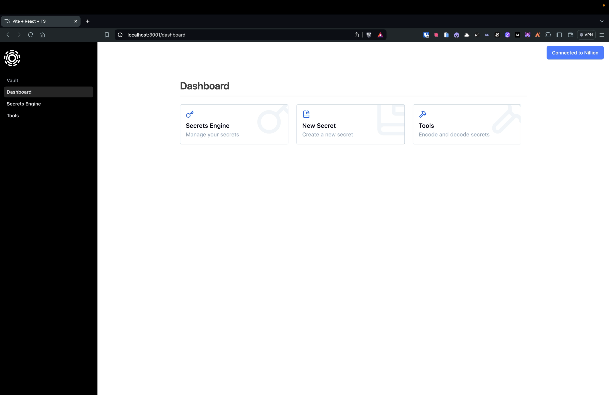

<p align="center">
</p>

Transcend Vault is a Multi-Peer Vault Storage which is gated by a secure Multi-Party Computation (MPC) based Biometric Authentication System.

It uses Nillion for Blind Computation of matching and finding Euclidean Similarity between Face Descriptors.

Peer to Peer Network is established using libp2p and OrbitDB for storing the data over a P2P Database.

## Architecture 🏗️


## How it works 🛠️

### Vault Creation

To Create a Vault user need to connect to Nillion Metamask Snap. This will give Access to `UserKey` which is a Ed25519 KeyPair encoded in Base58 format.

This `UserKey` is used to start a Libp2p Node in the browser by converting it into a PeerID.

```ts
const key = base58.decode(userKey);
const privKey = key.subarray(0, 32);
const pubKey = key.subarray(32);

const peerId = PeerId.createFromPrivKey(privKey);
```

Then this Libp2p Node connects to Bootstrap Node and starts discovering other peers in the network using PubSub Discovery Mechanism.

Users can select Multiple Peers to create a Vault.

Then we create a OrbitDB Database for the Vault which stores the store_id for the secrets in the Vault.

To set Permissions for the Database we use `user_id` for each peer, we can get this using PeerID public key.

```ts
const pubKey = peerId.publicKey.subarray(4); // last 4 are protocol bytes
const hash = sha512(pubKey);
const user_id = base58.encode(hash);
```

At at last we set the write permissions for the Database using the `user_id` of the selected peers and update the Database metadata.

---

### Biometric Authentication

Biometric Authentication is done using Nada Programs. During Vault Import the user store the Face Descriptor on the Devnet. It is computed using FaceNet Model.

```ts
const faceDetector = new faceApi.TinyFaceDetectorOptions();
const { descriptor } = await faceApi
  .detectSingleFace(imageElement, faceDetector)
  .withFaceLandmarks()
  .withFaceDescriptor();
```

These descriptors are multiplied with the `1000` and rounded to the nearest integer and stored on the Devnet.

While Logging in the user captures the Face and get the Face Descriptor using the FaceNet Model.

Then these face descriptors used to compute the Euclidean Similarity between the stored Face Descriptor and the Captured Face Descriptor.

This is done through Nada Programs, here is the main logic for the Nada Program:

```python
def sqrt(num: SecretInteger):
    guess = num
    for _ in range(12):
        guess = (guess + num / guess) / Integer(2)
    return guess


def get_euclidean_distance(actual: list[list[SecretInteger]], given: list[SecretInteger]) -> Integer:
    distances: list[Integer] = []
    for encoding in actual:
        distance = Integer(0)
        for i in range(DESCRIPTOR_SIZE):
            diff = encoding[i] - given[i]
            squared_diff = diff * diff
            distance += squared_diff
        distances.append(sqrt(distance))
    return distances[0]
```

> **Note**: We are using approximations for the square root function as nada doesn't support square root function. This is done by using Newton's Method for Square Root and is done for 12 iterations.

If the Euclidean Similarity is greater than `550` then the user is authenticated and the Vault is unlocked.

We can also provide multiple descriptors for the same user to increase the accuracy of the Face Matching as actual parameter is a list of list of SecretIntegers.

---

## Storing Secrets

While storing Secrets we need to get the users for the Vault and then get the `user_id` for each user to set `retrieve`, `update`, `delete` permissions for the Secrets.

We can get Peers information from the OrbitDB Database Metadata.

```ts
const { hash } = parseAddress(dbAddress);
const cid = CID.parse(hash, base58btc);
const bytes = await ipfs.blockstore.get(cid);
const res = await Block.decode({
  bytes,
  codec: dagCbor,
  hasher: sha256,
});

const peers = res.meta.peers;
```

Then we can get all the `user_id` for the peers and set the permissions for the Secrets.

---

### Data Replication

Data Replication is done using OrbitDB. The data is stored in the OrbitDB Database and is replicated to all the peers in the network.

> **Only `store_id` is stored in the OrbitDB Database, the actual data is stored on the Nillion.**

---

## Demo Video 🎥

https://youtu.be/m1_AWJ8iMpY

[](https://www.youtube.com/watch?v=m1_AWJ8iMpY)

## Screenshots 📸

<table>
  <tr>
    <td valign="top" width="50%">
      <br>
      
    </td>
    <td valign="top" width="50%">
      <br>
      
    </td>
  </tr>
</table>

<table>
  <tr>
    <td valign="top" width="50%">
      <br>
            
    </td>
    <td valign="top" width="50%">
      <br>
            
    </td>
  </tr>
</table>

<table>
  <tr>
    <td valign="top" width="50%">
      <br>
            
    </td>
    <td valign="top" width="50%">
      <br>
            
    </td>
  </tr>
</table>

<table>
  <tr>
    <td valign="top" width="50%">
      <br>
            
    </td>
    <td valign="top" width="50%">
      <br>
            
    </td>
  </tr>
</table>

## 🧑🏼‍💻 Tech Stack

- **Frontend**: Vite, Tailwind CSS, shadcn
- **Integration**: `libp2p`, `@orbitdb/core`, `face-api.js`, `helia`, `blockstore`.
- **Programs**: `nada`

## Get Started 🚀

The following repository is a turborepo and divided into the following:

- **apps/www** - The web application built using Vite.

First install the dependencies by running the following:

```
pnpm install
```

Then fill in the Environment variables in `apps/www/.env.local` as empty strings, these will be automatically filled in by the `pnpm run pre-dev` command.

```env
VITE_BOOTSTRAP_MULTIADDRS=""
VITE_NILLION_PROGRAM_ID=""
```

Fill in the Nillion UserKey and PORT for the Bootstrap Node in `packages/relay-server/.env` file

```env
USER_KEY=""
PORT=8888
```

Then run the following command to start a nillion-devnet, store program and start a libp2p bootstrap node:

```bash
pnpm run pre-dev
```

Copy the bootstrap node multiaddr and fill it in the `VITE_BOOTSTRAP_MULTIADDRS` in the `apps/www/.env.local` file.

`VITE_NILLION_PROGRAM_ID` and other environment variables will be automatically set in the `apps/www/.env.local` file.

Then run the following command to start the application:

```bash
pnpm dev
```

---
